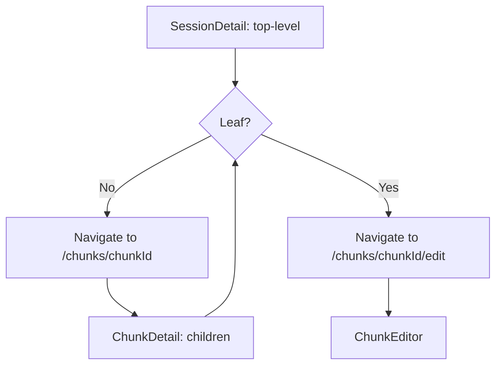

# Re-chunk Feature with Hierarchy (Updated)

## Context

Chunks are row ranges. Chunking is configured once via `setChunking` and replaces all chunks. User wants: (1) re-chunk a chunk, (2) hierarchy preserved when viewing—session panel shows top-level only; tap chunk → children (if container) or records (if leaf). No backward compatibility required.

## Current Codebase (as of plan update)

**Schema** (`[server/src/db/schema.sql](server/src/db/schema.sql)`):

- `chunks`: `(session_id, chunk_index)` PK, `start_row`, `end_row`, `assignee_name`, `claimed_at`, `status`, `completed_at`, `tag`
- `sessions`: `updated_at`, `delete_pin` (PIN for delete)

**DB init** (`[server/src/db/index.js](server/src/db/index.js)`): Runs schema.sql, then ALTER TABLE for `creator_name`, `delete_pin`, `tag` if missing.

**sessionService**: `getChunks`, `getChunk`, `claimChunk`, `completeChunk`, `updateChunkTag`, `updateChunkAssignee`, `markRowsAsViewed`—all use `chunkIndex`. `createChunks` inserts with `chunk_index` 0, 1, 2…

**chunks routes** (`[server/src/routes/chunks.js](server/src/routes/chunks.js)`): GET/PUT use `:chunkIndex`; PUT `tag`, `assignee` endpoints.

**Client**:

- `[SessionDetail.jsx](client/src/pages/SessionDetail.jsx)`: Delete flow (PIN), status badges (Active, Mark Completed, Discard), tag editing per chunk, clickable rows → edit. Uses `chunk_index`.
- `[ChunkEditor.jsx](client/src/pages/ChunkEditor.jsx)`: Uses `chunkIndex` from params. Uses `labeledInChunk` from API.
- Routes in `[main.jsx](client/src/main.jsx)`: `sessions/:id`, `sessions/:id/chunks/:chunkIndex/edit`.

## Design: Parent-child hierarchy

**Core idea**: Add `id` and `parent_id` to chunks. When re-chunking, **keep the parent** and insert children. Parent becomes a container; only leaf chunks are claimable/editable.

**Parent retains assignee** when re-chunked (for audit/ownership). Children start unclaimed.

## Schema Change

Replace chunks table in `[server/src/db/schema.sql](server/src/db/schema.sql)`:

```sql
CREATE TABLE chunks (
  id INTEGER PRIMARY KEY AUTOINCREMENT,
  session_id INTEGER NOT NULL REFERENCES sessions(id) ON DELETE CASCADE,
  parent_id INTEGER REFERENCES chunks(id) ON DELETE CASCADE,
  chunk_index INTEGER NOT NULL,
  start_row INTEGER NOT NULL,
  end_row INTEGER NOT NULL,
  assignee_name TEXT,
  claimed_at TEXT,
  status TEXT NOT NULL DEFAULT 'unclaimed',
  completed_at TEXT,
  tag TEXT
);
CREATE INDEX idx_chunks_parent ON chunks(session_id, parent_id);
```

- `parent_id NULL` = top-level
- `chunk_index` = order among siblings
- Keep `tag` (existing column)

**DB init**: After schema change, add ALTER for `parent_id` if we need to support existing DBs. Per prior discussion: no migration; reset DB for new schema.

## Implementation

### 1. Backend: sessionService

**createChunks**: Insert with `parent_id NULL`, `chunk_index` 0, 1, 2… Use new INSERT that includes `id` (auto). Ensure `tag` defaults to NULL.

**getChunks(sessionId, parentId = null)**:

- `WHERE session_id = ? AND (parent_id IS NULL AND ? IS NULL) OR (parent_id = ?)` + `ORDER BY chunk_index`
- Include `id`, `parent_id`, `childCount` (subquery or join: COUNT where parent_id = this id)
- Keep `tag`, `rowsInChunk`, `rowsEditedInChunk`

**getChunk(sessionId, chunkId)**: `WHERE id = ?` (chunkId is id). Include `childCount`.

**claimChunk(sessionId, chunkId, name)**: Reject if chunk has children. Use `id` for lookup.

**completeChunk, getChunkRowRange, getChunkAssignee, updateChunkTag, updateChunkAssignee, markRowsAsViewed**: All switch to `chunkId` (id). Update SQL to `WHERE id = ?`.

**rechunkChunk(sessionId, chunkId, options)**:

- Get chunk by id; must be leaf (no children).
- Compute sub-ranges from `chunkSize` or `numChunks`.
- INSERT children with `parent_id = chunkId`, `chunk_index` 0..N-1. Parent stays; becomes container.

**getSessionStats**: Count only leaf chunks (WHERE no row has parent_id = this chunk's id). Or count chunks that have no children.

### 2. API: chunks routes

- **GET /api/sessions/:id/chunks?parentId=** — parentId optional; omit = top-level
- All routes: change `:chunkIndex` → `:chunkId`. `chunkId` = chunk `id`.
- **PUT /api/sessions/:id/chunks/:chunkId/rechunk** — body: `{ chunkSize?, numChunks? }`

### 3. Frontend

**SessionDetail** (`[client/src/pages/SessionDetail.jsx](client/src/pages/SessionDetail.jsx)`):

- Fetch `GET /chunks` (no parentId). Use `id` instead of `chunk_index` for keys/links.
- Container: **[View]** → `/sessions/:id/chunks/:chunkId`. Preserve tag editing, status display.
- Leaf: **[Claim]** / **[Resume]** → `/sessions/:id/chunks/:chunkId/edit`. Row click → same.
- **[Re-chunk]** per leaf chunk (modal or inline: chunkSize or numChunks).
- Tag: `handleSaveTag(chunkId, value)`; API uses chunkId.

**ChunkDetail** (new, `[client/src/pages/ChunkDetail.jsx](client/src/pages/ChunkDetail.jsx)`):

- Route: `/sessions/:id/chunks/:chunkId`
- Fetch chunk + children (`GET /chunks?parentId=chunkId`). If leaf → redirect to edit.
- Render same table UI as SessionDetail (children). Breadcrumb: "← Back to Project" or "← Back" with parent context.
- Re-chunk on leaf children.

**ChunkEditor** (`[client/src/pages/ChunkEditor.jsx](client/src/pages/ChunkEditor.jsx)`):

- `useParams()` → `chunkId` (not chunkIndex). All fetch URLs use `chunkId`.
- Storage keys: use `chunkId` in `LAST_VIEWED_OFFSET_KEY`, `LAST_UPDATED_ROW_KEY`.

**Routing** (`[client/src/main.jsx](client/src/main.jsx)`):

- Add `sessions/:id/chunks/:chunkId` → ChunkDetail
- Change `sessions/:id/chunks/:chunkIndex/edit` → `sessions/:id/chunks/:chunkId/edit`

### 4. Re-chunk validation

- Only leaf chunks can be re-chunked.
- Each sub-chunk ≥ 1 row; ≥ 2 sub-chunks.
- `chunkSize` or `numChunks` (one required).

## Files to Modify


| File                                                                             | Changes                                                                                 |
| -------------------------------------------------------------------------------- | --------------------------------------------------------------------------------------- |
| `[server/src/db/schema.sql](server/src/db/schema.sql)`                           | Replace chunks table: add id, parent_id; keep tag                                       |
| `[server/src/db/index.js](server/src/db/index.js)`                               | Add ALTER for parent_id if needed for dev; or rely on fresh schema                      |
| `[server/src/services/sessionService.js](server/src/services/sessionService.js)` | chunkId everywhere, getChunks(parentId), rechunkChunk, leaf-only claim, leaf-only stats |
| `[server/src/routes/chunks.js](server/src/routes/chunks.js)`                     | GET ?parentId, :chunkId params, PUT rechunk                                             |
| `[client/src/pages/SessionDetail.jsx](client/src/pages/SessionDetail.jsx)`       | Top-level chunks; container→View, leaf→Claim; Re-chunk; use chunkId for tag/links       |
| `client/src/pages/ChunkDetail.jsx` (new)                                         | Children list; breadcrumb; same table pattern as SessionDetail                          |
| `[client/src/pages/ChunkEditor.jsx](client/src/pages/ChunkEditor.jsx)`           | chunkId in params, storage keys, API URLs                                               |
| `[client/src/main.jsx](client/src/main.jsx)`                                     | Add ChunkDetail route; chunkIndex→chunkId in edit route                                 |
| `[e2e/create-session.spec.js](e2e/create-session.spec.js)`                       | Use chunkId (from API response); add rechunk + hierarchy test                           |


## Data flow




## Testing

- Session shows top-level; tap container → ChunkDetail; tap leaf → ChunkEditor.
- Re-chunk leaf → container with children; parent shows [View]; parent keeps assignee if any.
- Tag editing still works with chunkId.
- Stats count leaf chunks only.
- E2E: create session, chunk, optionally re-chunk, claim, label, verify flow.

