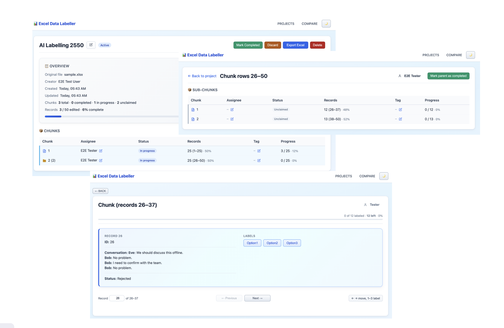

# Excel Data Labeller

Web app for chunked editing of large Excel files: upload, choose sheet, configure columns and target options, then let employees claim chunks and edit one row at a time. Export merges all edits with a pre-export integrity check.



## Prerequisites

- **Node.js 18+** — [nodejs.org](https://nodejs.org/)

## Quick start

1. **Clone** the repo.
2. **Setup** — install dependencies:
   ```
   ./scripts/setup.sh
   ```
3. **Start** the server (dev by default):
   ```
   ./scripts/start.sh
   ```
   Open http://localhost:36001
4. **Stop** when done:
   ```
   ./scripts/stop.sh
   ```

That's it.

## Scripts

| Script | Description |
|--------|-------------|
| `./scripts/setup.sh` | Install dependencies (server + client). |
| `./scripts/start.sh` | Start in dev (frontend on 36001). Use `-p` for prod (single process on 36000). |
| `./scripts/stop.sh` | Stop server and frontend. |
| `./scripts/status.sh` | Check if server and frontend are running. |
