# Quick Start Guide

This guide walks you through the main flows: creating a project, labelling in chunks, re-chunking, and exporting. Screenshots are in `docs/quickstart/`.

## Flow overview

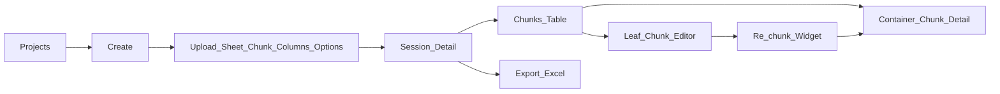

---

## 1. Create a project

1. Open **PROJECTS** (home) and click **CREATE**, or go to `/create`.
2. **Upload or choose a file:** Upload an Excel file, or select a preloaded file from the dropdown.
3. **Choose a sheet:** Select the worksheet to use and click **Continue**.
4. **Chunking:** Set the record range (from/to rows) and how to split:
   - **Equal** – split into N equal-sized chunks.
   - **Custom** – comma-separated sizes (e.g. `10,20,30`).
   - **Manual** – one chunk per line in the text area.
   Click **Continue**, then **Confirm**.
5. **Target columns:** Check the columns that will be editable (e.g. Status, target labels). Choose “New column” if you want to add a new column for labels. Click **Continue**.
6. **Options:** Enter the dropdown options (one per line) for the target column(s), if applicable. Click **Finish and open project**.

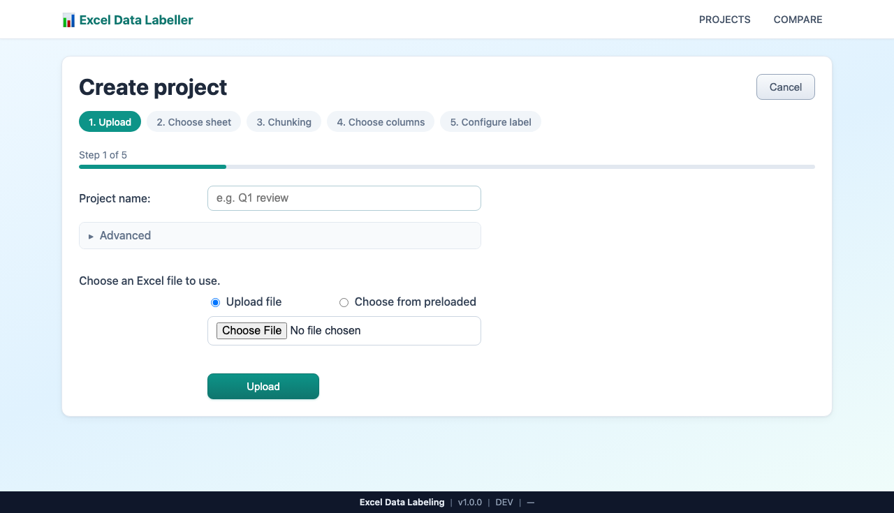

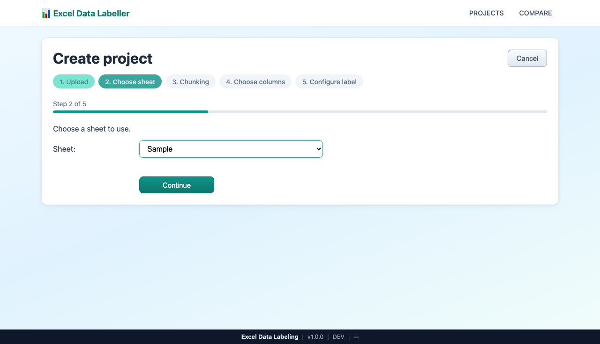

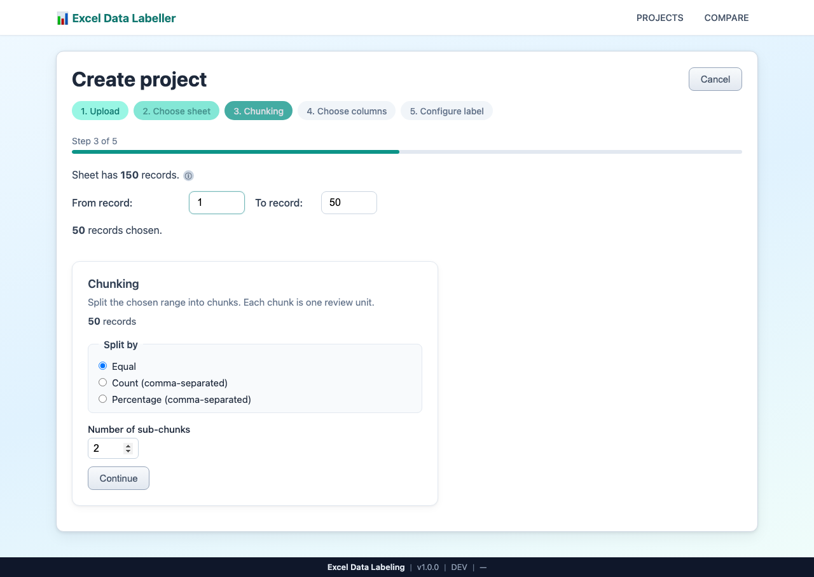

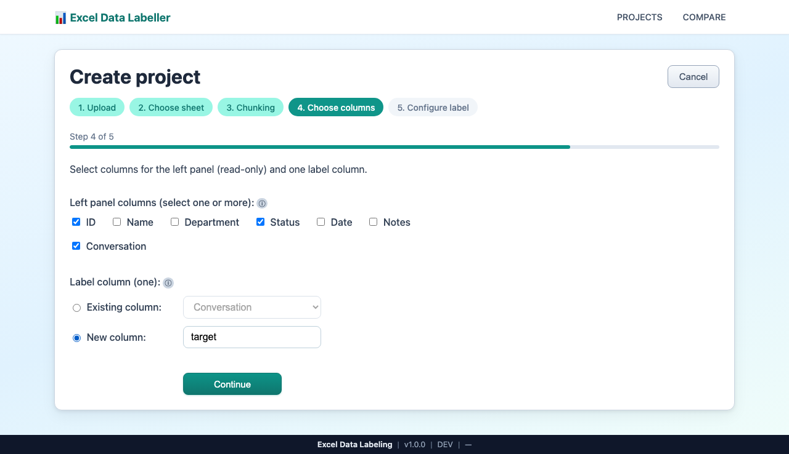

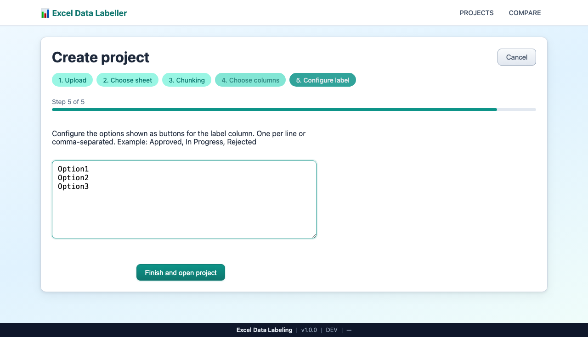

---

## 2. Labelling in the chunk

1. On the **session detail** page, you see **Stats** and a **Chunks** table.
2. Click a **leaf** chunk row (single-doc icon). You open the **Chunk Editor**.
3. If the chunk is unclaimed, enter **Your name** and click **Claim chunk**.
4. Use **Records per view** and pagination to move through rows.
5. Edit row cells (e.g. Status, target column). Changes save per field (blur or Enter).

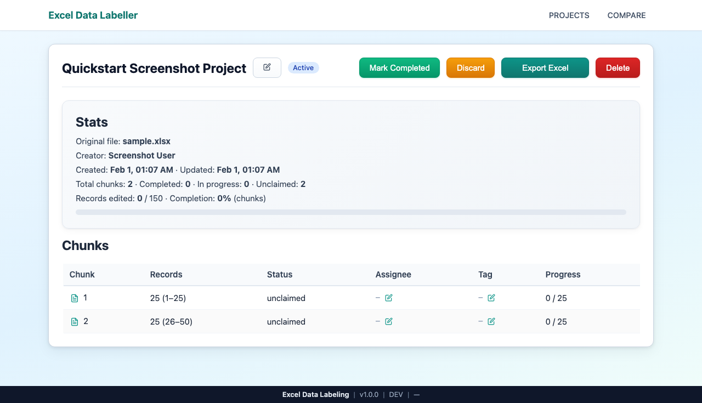

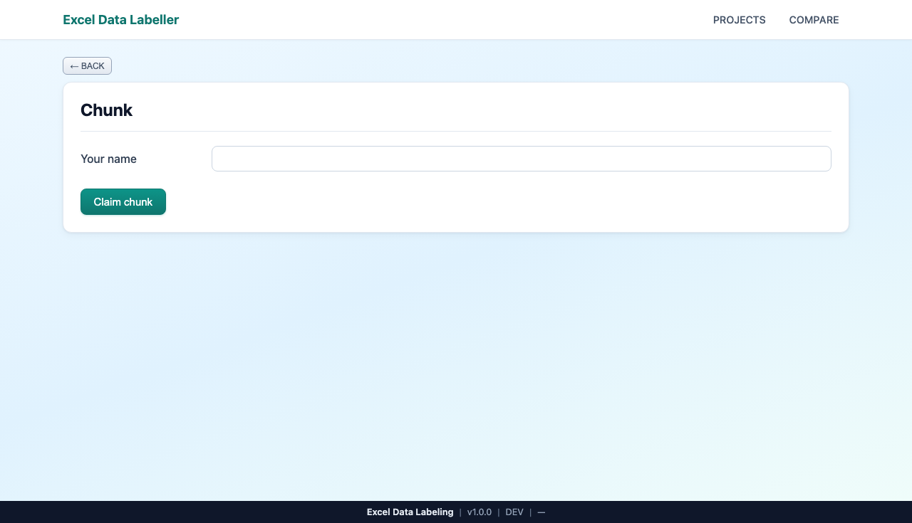

---

## 3. Re-chunking

1. From the **Chunk Editor** (a leaf chunk), find the **Re-chunk** card.
2. Click **Split this chunk**.
3. Choose **Equal**, **Custom**, or **Manual** and set sizes (e.g. Equal with 2 sub-chunks).
4. Click **Split**, then **Confirm**.
5. You are redirected to **Chunk Detail** (container view) with the new sub-chunks listed.

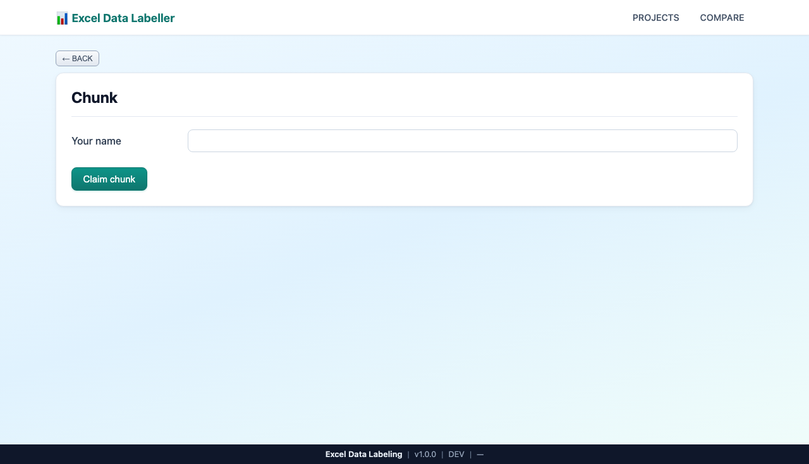

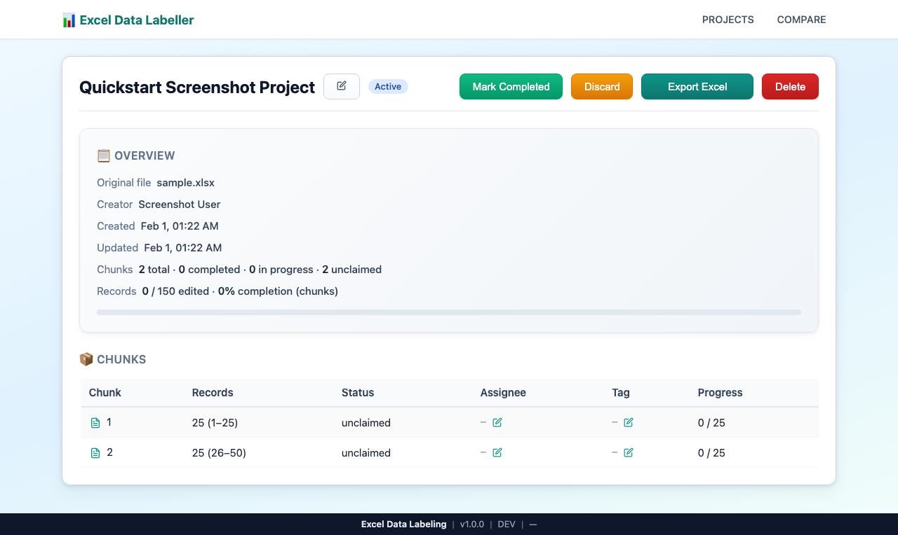

---

## 4. Export

1. Go back to the **session detail** page (project header or **Back to project** from Chunk Detail).
2. Click **Export Excel**.
3. The app downloads `export-{sessionId}.xlsx` with all edits merged.

---

## What else?

### View projects and open a project

- **PROJECTS** (home) lists all sessions. Click a row to open that project’s session detail (Stats + Chunks table).

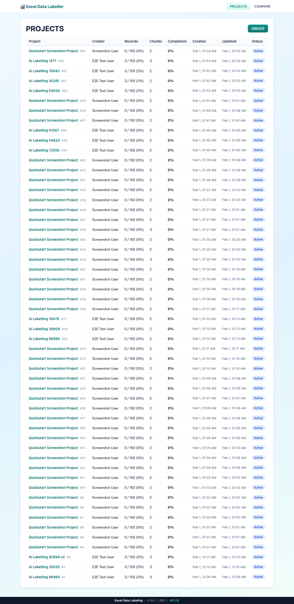

### Session detail overview

- **Stats:** Original file, creator, records edited, total chunks, completed/in progress/unclaimed, completion %.
- **Chunks table:** Chunk index, records range, Status, Assignee, Tag, Progress.
- **Leaf vs container:** Click a **leaf** chunk (single-doc icon) → Chunk Editor. Click a **container** (folder icon) → Chunk Detail (sub-chunks).

### Editing assignee and tag

- On session detail, use the pencil icon next to **Assignee** or **Tag** on a chunk row. Type the value and press Enter or blur to save.

### Mark Completed / Discard / Reopen

- Buttons in the session header change status. **Export Excel** is always available.

### Delete project

- Click **Delete** in the header → confirm → enter the PIN you set when creating the project (or the default PIN).

### Compare columns (optional)

- **COMPARE** in the nav opens a separate tool: upload or choose a file → select sheet → pick two columns to compare. It does not create a labelling project.

---

## How to capture screenshots

If you need to refresh the screenshots in `docs/quickstart/`:

1. Start the app: `npm run start`, then open http://localhost:36001.
2. Create a project with `samples/sample.xlsx` (or any Excel file) so screens show real data.
3. Capture each state listed in the plan (projects list, create steps, session detail, chunk editor, re-chunk widget, chunk detail, export). Save as `01-projects-list.png` through `11-export.png` in `docs/quickstart/`.

You can use the browser’s screenshot feature, Playwright, or any MCP browser tool that saves screenshots to these paths.
