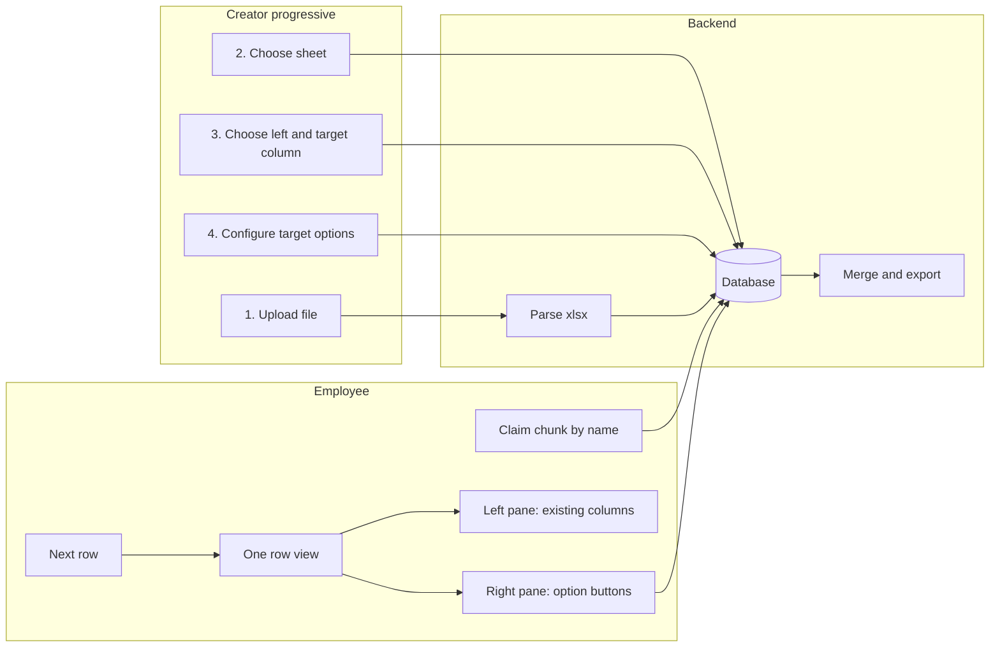

# Excel Chunked Web App – Plan (revised)

## Goal

- **Session creator (progressive discovery):** (1) Uploads Excel file. (2) Chooses one sheet from the list. (3) Chooses one or more left-panel columns (read-only) and exactly one right/target column (existing or new). (4) Configures the options shown as buttons for the target column; options can be entered manually or pre-filled from an existing column. Session can last days.
- **Employees (100s):** Access at different times; claim a chunk by name; work in the chunk editor with **N rows shown at a time** (chunk user chooses N; default 1): left pane shows existing column values, right pane shows target options as buttons; user clicks one option per row, then moves to the next row or next batch of rows.
- **Backend:** Database-backed (no in-memory session); parse Excel, store rows and config, persist chunk claims and row-level edits; merge and export one Excel file.
- **Hosting:** Linux PC; Node + DB (SQLite or PostgreSQL).

---

## Architecture (high level)

- **Database:** Sessions, session config (left columns, target column, options), raw row data, chunk assignments, and per-row target edits. Session and data survive restarts and many concurrent users.
- **Creator flow (progressive discovery):** (1) Upload file → backend stores file, returns sheet names. (2) User chooses sheet → backend parses that sheet, stores rows and headers. (3) User chooses left-panel columns (one or more) and one target column (existing or new). (4) User configures target options (buttons); options can be manually entered or pre-filled from unique values of an existing column. Session is then ready for employees.
- **Employee flow:** Pick session → enter name → claim a chunk → choose **how many records to show at a time** (default 1) → see that many rows (left = existing values, right = option buttons per row) → click option to set value per row, advance to next row or next batch → repeat until chunk done or leave (chunk stays claimed; can resume later).
- **Export:** Merge original rows with stored edits (target column overwritten where an edit exists), produce single `.xlsx`.

---

## Session creation – progressive discovery (4 steps)

Session creation is a step-by-step wizard; each step reveals the next.

1. **Step 1 – Upload file**
  User selects an Excel file and uploads. Backend stores the file and reads **sheet names only** (no full parse yet). UI shows the list of sheet names. Chunk size can be set here or in step 2.
2. **Step 2 – Choose sheet**
  User picks one sheet from the list. Backend parses **that sheet only**, stores headers and all row data in the DB, creates chunks. UI shows confirmation (e.g. row count, chunk count). Session now has a chosen sheet and data.
3. **Step 3 – Choose columns**
  UI shows the **column names** (headers) of the chosen sheet. User selects:
  - **Left panel:** One or more columns (existing) to show read-only in the editor.
  - **Right/target:** Exactly one column. It can be:
    - An **existing column** (user will overwrite/add values via buttons), or
    - A **new column** (name entered by user; column does not exist in the file yet; export will add it).
     Backend saves `left_columns` and `target_column` (and whether target is new). If target is new, export logic adds that column to the workbook.
4. **Step 4 – Configure target options**
  User defines the list of options shown as **buttons** for the target column. Options can be:
  - **Manually entered** (type or paste, e.g. one per line or comma-separated), or
  - **Pre-filled from an existing column:** user picks a column (e.g. "Status"); backend returns **unique values** from that column; creator can use them as-is or edit the list.
   Backend saves `target_options`. Session is fully configured and ready for employees.

---

## Two-panel editor UI (N rows at a time)

- **Records per view:** The **chunk user** (employee) chooses how many **records to show at a time** in the editor. **Default is 1.** Options can be e.g. 1, 5, 10, or a number input. The editor displays that many rows per "page"; navigation moves by that many rows (e.g. Next 5 / Previous 5 when N=5).
- **Left pane (read-only):** Shows only the columns the creator selected (e.g. "Name", "ID", "Department"). Displayed as label–value pairs or a small table for the **current row(s)** (1 to N rows visible at once; default N=1).
- **Right pane (target):** The single target column. Creator-defined options are shown as **buttons** (e.g. "Approved", "Rejected", "Needs Review"). User clicks one → backend saves that value for the current row's target column → UI advances to the **next row** in the chunk (or "Previous" to go back).
- **Navigation:** Current row index within chunk (e.g. "Row 3 of 100"), Previous / Next; optional "Skip" if you want to leave a row for later. Step by N rows (e.g. Rows 1–5 of 100 when N=5). The target column is single choice only: exactly one option per row.

---

## Tech choices

| Layer            | Choice                       | Rationale                                                                                                                                                                             |
| ---------------- | ---------------------------- | ------------------------------------------------------------------------------------------------------------------------------------------------------------------------------------- |
| Backend          | Node.js + Express            | Matches your work; simple API and file handling.                                                                                                                                      |
| Database         | **SQLite**                   | Session lasts days; 100s of users; persistent sessions, config, row data, chunk claims, row edits. Single file (e.g. `server/data/excel-app.db`); no separate DB server. |
| Excel read/write | **ExcelJS**                  | Good for large files; read by row range, write merged workbook on export.                                                                                                             |
| Frontend         | React + Vite                 | Same as townhall; small bundle.                                                                                                                                                       |
| Linux run        | Node + PM2 or systemd        | Single Node process; serve React build from Express.                                                                                                                                  |

---

## Database schema (conceptual)

- **sessions** — `id`, `name` (optional), `file_path` (stored file), `sheet_name` (after step 2), `headers` (JSON array), `total_rows`, `chunk_size`, `created_at`, `status` (e.g. draft / configured). After step 2 the sheet is parsed and rows stored.
- **session_config** — `session_id` (FK), `left_columns` (JSON: array of column names for left pane), `target_column` (name of column users update), `target_column_is_new` (boolean; if true, column is added on export), `target_options` (JSON: array of strings for buttons). One row per session.
- **session_rows** — `session_id`, `row_index` (0-based), `data` (JSON: array of cell values in header order). Stores full original row data for every row so export can merge and so left pane can show any column.
- **chunks** — `session_id`, `chunk_index`, `start_row`, `end_row`, `assignee_name` (nullable), `claimed_at` (nullable), `status` (e.g. `unclaimed` | `in_progress` | `completed`), `completed_at` (nullable). When a user finishes all rows and clicks "Mark completed", set `status = completed` and `completed_at`.
- **row_edits** — `session_id`, `row_index`, `target_value` (string the user chose). Only the target column is updated; export uses this to overwrite that column for the row.

Export: for each `row_index`, take `session_rows.data`, replace the target column's value with `row_edits.target_value` if present, then write rows to Excel.

---

## Data integrity (import and export)

To keep Excel data correct when importing and exporting, especially with **empty rows** in the source, use **stable row indices** and **position-based read/write**.

**1. Stable row indices (do not skip rows)**

- **row_index** is 0-based and means **position in the sheet**: first data row = 0 (Excel row 2), next = 1 (Excel row 3), etc.
- On **import:** Read **every** row in order. **Do not skip empty rows.** For each row position, insert one `session_rows` row with that `row_index` and the cell values for that row. Empty cells can be stored as `null` or `""` in the `data` array. That way `row_index` always matches the original Excel row position.
- **total_rows** = number of data rows (rows after the header). So we have exactly `session_rows` for `row_index` 0 .. total_rows-1, with no gaps.

**2. Empty rows**

- Empty rows in the source are still **one row per position**. Store them as a row with `data` = array of empty/null values (length = number of columns). On **export**, write one output row per `row_index` in order (0, 1, 2, ...). Empty rows are written as empty rows in the same positions, so the layout of the exported file matches the source.

**3. Export: preserve layout and only overwrite the target column**

- Export in **row_index order** (0 to total_rows-1). For each `row_index`: load `session_rows.data` for that row; if there is a `row_edits` row for this session and row_index, set the **target column** in that row's data to `row_edits.target_value`; leave all other columns unchanged; write that row to the output sheet at the same position (e.g. output Excel row = row_index + 2 if row 1 is header).
- Do **not** reorder, skip, or merge rows. Do **not** change any column except the target column for rows that have an edit. That way all non-target columns stay as in the source, empty rows stay empty (except target if edited), and edited rows only change in the target column.

**4. Headers**

- On import, store the first row as **headers** (session.headers). On export, write that same header row first, then data rows in row_index order. Do not change headers on export.

**5. Optional checks**

- **Import:** After parsing, assert that the number of rows inserted into `session_rows` equals the expected data row count (e.g. sheet row count minus 1 for header).
- **Export:** When writing, assert that you write exactly `total_rows` data rows so the exported file has the same row count as the source.

**6. Pre-export integrity check (before export)**

Before generating the export file, run an **integrity check** to ensure `session_rows` is still in sync with the stored Excel file. Only if the check passes, perform the full export.

- **What to compare:** Pick **one of the non-modified left columns** (from `session_config.left_columns`). That column is never updated by users, so it should match the source file exactly.
- **How:** Re-read the stored Excel file (session's `file_path`), open the chosen sheet, and for each data row (row_index 0 .. total_rows-1) read the cell value for that column. Compare with the value in `session_rows.data` for the same row_index and column (by header index). Use a consistent normalization for empty/null, numbers, and dates (e.g. string comparison or type-aware compare) so minor formatting differences do not cause false failures.
- **Outcome:** If **every** row matches for that column, the check **passes** → proceed with full export (merge session_rows + row_edits, write xlsx, return file). If **any** row differs, the check **fails** → do **not** export; return an error (e.g. HTTP 409 Conflict or 400) with a message like "Integrity check failed: data out of sync with source file. Re-import the sheet or contact support." so the user knows the export was blocked for safety.
- **Why:** This catches accidental corruption or out-of-sync DB state (e.g. file was replaced, rows were deleted elsewhere). Only after confirming that at least one non-modified column matches the source do we export, so the exported file is based on data we have verified against the actual Excel sheet.

---

## Session stats and chunk status (when session is chosen)

When a user opens a session, show a **session stats** view and a **chunk list** with per-chunk status.

**Session-level stats (nice to show):**
- Total number of chunks.
- Chunk completion: e.g. "12 of 200 chunks completed" or a progress bar (chunks completed / total chunks).
- Rows edited: total count of row_edits for the session (optional: % of total rows).
- Optional: chunks unclaimed / in progress / completed counts.

**Per-chunk (chunk list):**
- Chunk # and row range (e.g. Chunk 1: rows 1–100).
- **Status:** Unclaimed | In progress (claimed, not yet completed) | Completed (user marked complete).
- **Assignee name** (if claimed).
- **Rows edited in chunk:** e.g. 45/100 (count of edits in this chunk's row range).
- **Completed at** (if completed): timestamp when user marked the chunk complete.

**Chunk status lifecycle:** Unclaimed → (user claims) → In progress → (user clicks "Mark chunk as completed") → Completed. Backend stores chunks.status and chunks.completed_at; stats and chunk list APIs return these so the UI can show the dashboard and table.

---

## API (minimal)

**Creator – progressive discovery**

- `POST /api/sessions/upload` — multipart file only. Store file, read workbook to get sheet names (no full parse). Create session row (draft). Return `{ sessionId, sheetNames }`.
- `PUT /api/sessions/:id/sheet` — body: `{ sheetName, chunkSize? }`. Parse the stored file for that sheet only using **streaming/batch**: read headers, then iterate rows in batches (e.g. 500–1000), insert each batch into `session_rows`, then create `chunks` rows. Do not load all 20k rows into memory at once. Return `{ headers, totalRows, chunkSize }`.
- `GET /api/sessions/:id` — return session + config if set (for resume or employee view).
- `PUT /api/sessions/:id/config` — body: `{ leftColumns[], targetColumn, targetColumnIsNew? }`. Save left-panel columns and target column (existing or new). If `targetColumnIsNew` is true, target column is added on export.
- `GET /api/sessions/:id/columns/:columnName/unique` — return unique values for that column (to pre-fill target options from an existing column). Optional: limit/sample for very wide columns.
- `PUT /api/sessions/:id/config/options` — body: `{ targetOptions: string[] }`. Save the list of options shown as buttons for the target column. Session is then fully configured.

**Employees**

- `GET /api/sessions` — list sessions (id, name, totalRows, chunkSize, config present or not).
- `GET /api/sessions/:id` — return session + config. Optionally include **session stats** (see below) when query param `stats=1` or always on session detail.
- `GET /api/sessions/:id/stats` — return **session-level stats** for the dashboard: `totalChunks`, `chunksUnclaimed`, `chunksInProgress`, `chunksCompleted`, `totalRows`, `rowsEdited` (count of row_edits), optional `completionPct` (chunks or rows). Enables nice summary when a session is chosen.
- `GET /api/sessions/:id/chunks` — list chunks with `chunkIndex`, `startRow`, `endRow`, `assigneeName`, `status` (unclaimed | in_progress | completed), `completedAt` (if completed), `rowsInChunk`, `rowsEditedInChunk` (count of edits in this chunk's row range). Enables per-chunk status and progress.
- `PUT /api/sessions/:id/chunks/:chunkIndex/claim` — body: `{ name }`. Claim chunk (reject if already claimed by someone else). Set chunk `status = in_progress`.
- `PUT /api/sessions/:id/chunks/:chunkIndex/complete` — body: `{ name }`. Mark chunk as completed (verify name matches assignee). Set `status = completed`, `completed_at = now`. User typically does this after finishing all rows in the chunk.
- `GET /api/sessions/:id/chunks/:chunkIndex/row/:rowOffset` — return **one or more rows** for editor. Query param `limit` (default 1): e.g. `?limit=5` returns 5 rows starting at `rowOffset`. Response: `{ rows: [{ leftValues, targetCurrentValue?, rowOffsetInChunk }, ...], offset, totalInChunk }`. Enables chunk user to choose how many records to show at a time (default 1).
- `PUT /api/sessions/:id/chunks/:chunkIndex/row/:rowOffset` — body: `{ name, targetValue }`. Save edit for that row's target column (verify name matches chunk assignee). Return success and optionally next row.

**Export**

- `GET /api/sessions/:id/export` — **Before export:** run pre-export integrity check (compare one non-modified left column from session_rows with the stored Excel file; see Data integrity). If check **fails** → return 409 (or 400) with message "Integrity check failed: data out of sync with source file". If check **passes** → merge `session_rows` + `row_edits` into one workbook, return `.xlsx` file.

---

## Frontend flows

1. **Creator (progressive discovery):**
  - **Step 1:** Upload file → backend returns sheet names → UI shows list of sheets.  
  - **Step 2:** User selects one sheet (and optionally chunk size) → backend parses that sheet, stores rows → UI shows success (row count, chunks).  
  - **Step 3:** UI shows column names; user selects one or more left-panel columns and one target column (dropdown for existing or "Add new column" with name input). Save config.  
  - **Step 4:** Configure target options: either type/paste options, or "Pre-fill from column" (pick column → backend returns unique values → creator uses or edits list) → save options. Session is then "live" for employees.
2. **Session detail (when session is chosen):** Show **nice stats**: total chunks, completion (e.g. "12 of 200 chunks completed", or progress bar), rows edited, and a **chunk list** with per-chunk: chunk #, row range, **status** (Unclaimed / In progress / Completed), **assignee name**, **rows edited in chunk** (e.g. 45/100). Refresh or poll so stats stay up to date.
3. **Employee – chunk list:** From session detail, see chunks with status and assignee. Enter name, click Claim on an unclaimed chunk (or Resume on own chunk). Chunk list shows status (Unclaimed, In progress, Completed) and assignee for each chunk.
4. **Employee – chunk editor:** After claim, chunk user chooses **how many records to show at a time** (default 1; e.g. 1, 5, 10). Load first batch (rowOffset=0, limit=N). Left pane: show left values for the N rows; right pane: target option buttons per row. On button click → PUT .../row/:rowOffset with targetValue for that row. Navigation: Previous / Next step by N rows (e.g. Rows 1–5 of 100). When user has gone through all rows (or when they are done), show **Mark chunk as completed**; on click call PUT .../complete. Optional: Save and exit to leave chunk in progress and resume later.
5. **Export:** Creator (or admin) clicks "Export Excel" → `GET /api/sessions/:id/export` → download file.

---

## Project structure (under `work/`)

Example root: `work/excel-to-web/`.

- **Backend:** `server/` — `package.json`, `src/server.js`, `src/db/` (schema, migrations or init script), `src/routes/sessions.js`, `src/routes/chunks.js`, `src/routes/export.js`, `src/services/excelService.js`, `src/services/sessionService.js` (DB access for sessions, config, rows, chunks, edits).
- **Frontend:** `client/` — Vite + React, `src/App.jsx`, routes/pages: SessionList, SessionCreate (wizard), **SessionDetail** (session stats + chunk list: total chunks, completion, rows edited, per-chunk status/assignee/rows edited), ChunkList, ChunkEditor (N rows at a time, default 1; two-panel + Mark chunk as completed).
- **Shared:** Chunk size default 100; max file size and row limit (e.g. 20k–50k rows); **streaming parse and batch insert** for `session_rows` so memory stays bounded on the Linux PC.

---

## Linux hosting

- **DB:** SQLite file in `server/data/` (e.g. `excel-app.db`); run migrations on first start.
- **Build:** `cd client && npm run build`.
- **Run:** `cd server && node src/server.js`; serve `client/dist` and `/api`. Use PM2 or systemd; bind to `0.0.0.0` if needed for LAN access.
- **Backups:** Back up the SQLite `.db` file regularly; session lives for days and 100s of users depend on it.

---

## Memory usage (~20k rows)

The file has on the order of **20,000 records**. Avoid loading the whole sheet or all rows into memory at once.

- **Step 1 (upload):** Store the file to disk; read the workbook only to get **sheet names** (e.g. ExcelJS workbook metadata / sheet list). Do **not** parse cell data yet. Memory: one workbook handle + sheet list.
- **Step 2 (choose sheet):** Parse the chosen sheet **in a streaming / row-by-row or row-range fashion**:
  - Read **headers** from the first row only.
  - Iterate rows in **batches** (e.g. 500–1000 rows at a time). For each batch: read that range of rows from the file, **insert only that batch** into `session_rows` (one `INSERT` transaction per batch), then discard the batch from memory. Do not hold 20k rows in a single array.
  - Use ExcelJS (or similar) APIs that allow reading by row range or row iterator rather than loading the entire worksheet into memory.
- **Insert `session_rows` in batches:** Use batched `INSERT` (e.g. 500 rows per transaction). Avoid one transaction with 20k rows or 20k single-row inserts without batching; batching keeps memory and transaction size bounded.
- **Export:** Read `session_rows` from SQLite in batches (e.g. `LIMIT/OFFSET` or cursor) and write rows to the output workbook in a streamed way if the library supports it; otherwise batch read (e.g. 1000 rows) and write. Do not `SELECT *` all 20k rows into memory in one go unless the host has plenty of RAM and you accept the spike.
- **Limits:** Enforce a max upload size (e.g. 50 MB) and a max row count (e.g. 50k) so the Linux PC stays predictable. For ~20k rows, batch sizes of 500–1000 rows are a reasonable default.

---

## Edge cases and limits

- **Two users, same chunk:** Reject claim if chunk already has a different assignee; first claim wins. Optional: "Release chunk" so user can unclaim.
- **Creator has not configured session:** Chunk list can show "Not configured"; editor only available after config (left columns, target column, options) is saved.
- **Large file / memory:** See **Memory usage (~20k rows)** above: streaming parse, batch insert for session_rows, batch read on export; enforce upload size and row limits.
---

## Implementation order

1. **Backend + DB:** Express app, DB layer (SQLite: sessions with file_path and status, session_config, session_rows, chunks, row_edits). Upload endpoint (store file, return sheet names only). Choose-sheet endpoint: **streaming/batch parse** of the chosen sheet and **batch insert** into `session_rows`, then create chunks. Config endpoints (left/target columns, target options; optional unique-values endpoint for pre-fill).
2. **Backend – employee and export:** Claim chunk, get row(s) for editor (limit param; default 1), save row edit, export (merge session_rows + row_edits in **batched read** if needed; add target column if new; write xlsx).
3. **Frontend – creator (wizard):** Step 1 upload → Step 2 choose sheet → Step 3 choose columns (left multi-select, target existing or new) → Step 4 configure options (manual or pre-fill from column), session list.
4. **Frontend – employee:** Session list → chunk list → claim → one-row editor (left pane, right pane with option buttons, Prev/Next, row X of Y).
5. **Export button** (creator or dedicated export page).
6. **Deploy:** DB init (SQLite path, e.g. `server/data/excel-app.db`), env (port, DB path, file size limit, batch size), PM2 or systemd, test on Linux.
